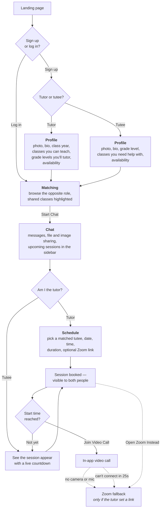

# Valley Tutor

A peer tutoring web app prototype for Valley Christian Schools. Students sign up as a tutor or tutee, get matched, and (eventually) chat, video call, and share files — all in one place.

## Status

Front-end prototype: landing page, login/signup, and a post-login app with profile, matching, chat (with file sharing), session scheduling, and video calls. Accounts, profiles, chats, and sessions are stored in the browser's `localStorage` with SHA-256-hashed passwords — there's no real backend yet.

## How it works

The path a student takes, from landing page to a live tutoring session. Role is chosen at sign-up and shapes everything after it — tutors and tutees see different profile prompts, get matched against each other, and only tutors can schedule.



The diagram shows one pass through, but nothing is one-shot: a student can keep any number of chats going at once, and a single chat can carry session after session. The Zoom link is never the default path — it's an escape hatch for when the in-app call can't happen, and only exists if the tutor pasted one in while scheduling.

## Pages

- `index.html` — marketing landing page
- `login.html` — log in / sign up (supports `?tab=signup` to open directly on the sign-up tab)
- `app.html` — the main app, with four tabs:
  - **Profile** — subjects, grade level, and availability
  - **Matching** — browse tutors/tutees by shared subject and start a chat
  - **Chats** — message threads with file sharing, plus an "Upcoming Sessions" sidebar (countdowns, a "Join Video Call" button once a session's time has come, and an "Open Zoom Instead" fallback link when the tutor set one)
  - **Schedule** (tutors only) — schedule a new session with a matched tutee, with an optional Zoom link as a fallback
- `video.html` — the embedded video call (WebRTC via `RTCPeerConnection`, signaled over `BroadcastChannel` for same-browser demo purposes). If the camera/mic can't be accessed, or the call can't connect within 25s, it offers the session's Zoom link as a fallback instead.

## Running locally

Static files, no build step. Serve the folder so `localStorage` behaves correctly (opening via `file://` can be flaky in some browsers):

```
python3 -m http.server 8934
```

Then visit `http://localhost:8934/index.html`.

## Branding

Colors, type, and logo usage follow the official Valley Christian Schools brand guidelines. Logo assets in `assets/` were extracted from the guidelines PDF for use on this prototype.

This is a student-built prototype, not an official VCS system.

## Roadmap

- Real backend + database for accounts (swap out the `localStorage` mock)
- Real signaling server for video calls (the current `BroadcastChannel` approach only works between tabs on the same device/browser)
- Real Zoom API integration for auto-generated meeting links, instead of tutors pasting their own
