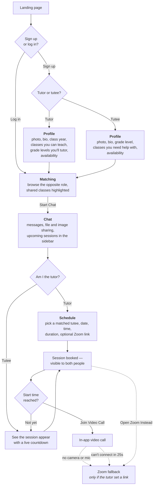

# Valley Tutor

A peer tutoring web app prototype for Valley Christian Schools. Students sign up as a tutor or tutee, get matched, and (eventually) chat, video call, and share files — all in one place.

## Status

Front-end prototype running on Next.js (App Router): landing page, login/signup, and a post-login app with profile, matching, chat (with file sharing), session scheduling, and video calls. Accounts, profiles, chats, and sessions are still stored in the browser's `localStorage` with SHA-256-hashed passwords — the interactive logic (`public/*.js`) hasn't been rewritten as React yet, it's the same vanilla-JS data layer loaded as classic scripts against server-rendered markup. There's no real backend or database yet; that's the next phase, once there's somewhere to actually run one.

## How it works

The path a student takes, from landing page to a live tutoring session. Role is chosen at sign-up and shapes everything after it — tutors and tutees see different profile prompts, get matched against each other, and only tutors can schedule.



The diagram shows one pass through, but nothing is one-shot: a student can keep any number of chats going at once, and a single chat can carry session after session. The Zoom link is never the default path — it's an escape hatch for when the in-app call can't happen, and only exists if the tutor pasted one in while scheduling.

## Routes

- `/` — marketing landing page
- `/login` — log in / sign up (supports `?tab=signup` to open directly on the sign-up tab)
- `/app` — the main app, with role-gated tabs:
  - **Profile** (opened via the header avatar, not a nav tab) — photo, bio, class/grade, availability, and a searchable "classes taken / classes need help with" picker
  - **Matching** (tutees only — they're the ones who choose a tutor) — browse tutors, filter by department/availability, sort by shared classes/rate/experience, and start a chat
  - **Chats** — message threads with file sharing, plus an "Upcoming Sessions" sidebar (countdowns, a "Join Video Call" button once a session's time has come, and an "Open Zoom Instead" fallback link when the tutor set one)
  - **Schedule** (tutors only) — schedule a new session with a matched tutee, with an optional Zoom link as a fallback
- `/video` — the embedded video call (WebRTC via `RTCPeerConnection`, signaled over `BroadcastChannel` for same-browser demo purposes). If the camera/mic can't be accessed, or the call can't connect within 25s, it offers the session's Zoom link as a fallback instead.

## Project structure

- `app/` — Next.js App Router pages (Server Components rendering the same markup the old static HTML had)
- `public/*.js` — the original vanilla-JS logic (`core.js`, `data.js`, `auth.js`, `app.js`, `video.js`), loaded per-page via `next/script`; still the single source of truth for all client-side behavior and the `localStorage` data layer
- `styles/` — the original hand-written CSS (`styles.css`, `app.css`, `video.css`), imported globally from `app/layout.tsx`
- `public/assets/` — VCS logo lockups

## Running locally

```
npm install
npm run dev
```

Then visit `http://localhost:3000`.

## Branding

Colors, type, and logo usage follow the official Valley Christian Schools brand guidelines. Logo assets in `public/assets/` were extracted from the guidelines PDF for use on this prototype.

This is a student-built prototype, not an official VCS system.

## Roadmap

- Real backend + database for accounts (swap out the `localStorage` mock) once there's somewhere to host one
- Rewrite the vanilla-JS pages as proper React components/hooks once the data layer moves to real API routes — right now the migration is structural (Next.js hosting a mostly-unchanged client app), not yet idiomatic React
- Real signaling server for video calls (the current `BroadcastChannel` approach only works between tabs on the same device/browser)
- Real Zoom API integration for auto-generated meeting links, instead of tutors pasting their own
- Deploy to Vercel once the database is reachable
